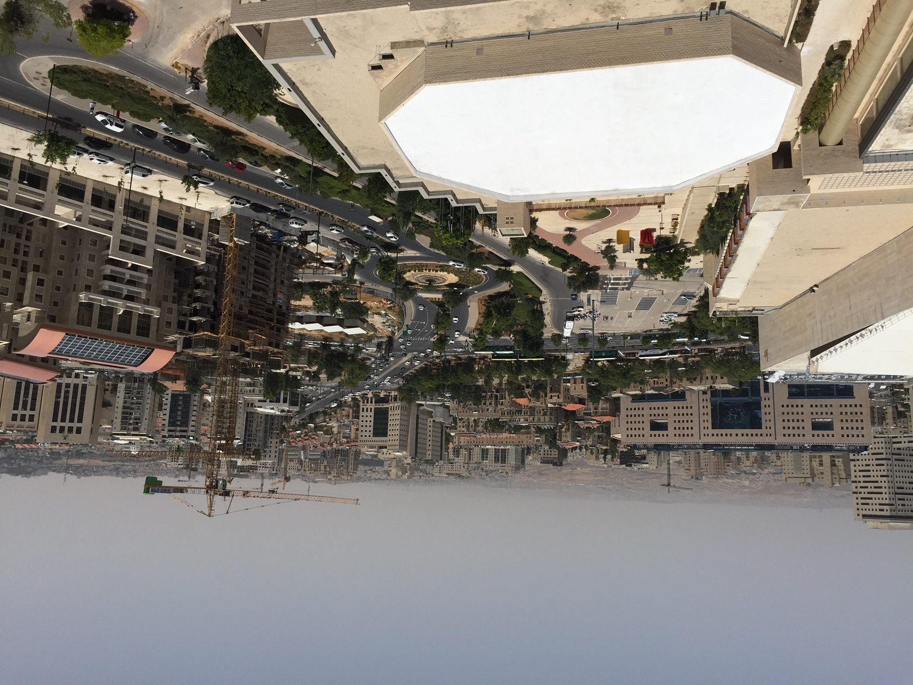

"Where are you from, brother?"

"Vietnam"

"Ohh.. Hanoi, Saigon, Halong bay ..."

"Exactly."

"You've been to the city? I can drive you to Bethlehem, museum, monastery, etc. Say, what religion are you? Christian,
Muslim, Buddish?

"No, I'm non religious"

"Ohh..."

He sounded disappointed. Being a taxi driver working on a shabbat, he is a highly sought after resource for tourists. He
was chatty and helpful. And thanks to him I got to have one of the best burger in a very long time. 

I was unprepared to find the all but the entire city closed on Saturday. The hotel was a typical bustle with family
getting up, with people coming in and out of breakfast room, and with kids running around screaming their heads of
despite parents' half-hearted effort to shush them. But outside the hotel was dead quiet. No cars running, no shops
open, and only on rare occasions was there groups of youngsters walking towards somewhere. It was a rather serene
feeling, a peaceful atmostphere that was in stark contrast with the city where I flew from. In Singapore, there is no
single day in the years when the MRTs don't run, when the shops don't open, when people don't flock to the malls. There
are over 15 days of public holiday in Singapore, but the spirits weren't there. Holidays in many countries are like bank
holiday in UK, where people have a day off work.  But I read somewhere that *holiday* comes from *holy day*, and its
original purpose is to observe God's rituals, to spend time with family. Of course for many lucky ones, the latter is
still true (though asking that shops and malls being open means that many others still have to work behind the
counters). In Vietnam we have Tet, a 3-day lunar holiday where all are supposed to close, where the streets are empty,
where families come together, and where people are just nicer to each other. It is old fashion, I know, but the fact
that everything closes in a holiday makes it an unique experience, a day different from the rest of the year. I like to
see everyone gets a break. I like everyone to not think about work, but focus more on spiritual things, on family, on
matters bigger than money. It was by thinking collectively that we become less selfish, because all of us would be after
the same goal.  

Had I not been hungry enough, focused enough in finding a non-kosher restaurant, I would have told my taxi driver that
being a non religious person would never stop me from feeling and appreciating the holiness in the air. 

After lunch, there being no taxis nearby, I walked around quite lost in the ancient city, trying to image how it would
transform tomorrow. Sun soaked streets, methodically blinking traffic lights (really they could have turn those off),
Jewish people in their dresses, stone builidings, impoverished trees, barren hills visible from distance. The temparture
was 30oC outside, but the breezes was kind and shades plentiful. There were laughters and whispers in the air, but far
off enough to accentuate the quietness. 15 minute later, conviced that I was nowhere close to the hotel, the search for
a precious taxi began.

Here is the scene today (Sunday), promising another week. 

