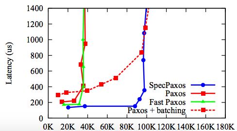

In the last 3 months I have finally came to face one of most important, yet most challenging (and feared) problem
in distributed systems, namely _distributed consensus_. First raised in 1980s, the problem of getting a set of
parties to agree on some value, remains an active area of research, with papers after papers appearing in
top-tier systems conferences like SIGCOMM, NSDI, SOSP, OSDI. One may remark at the fact that researchers in
the field have not reached a consensus on this decades-old consensus problem. Even without the human
irrationality in the loop, the range of subtlety and unpredictability needed to be considered in solving
consensus can perhaps be rivalled only by the human political systems. After all, there is no consensus on
what is the best political system, and we as a race have worked on it since forever (and if this year is of
any indication, we are failing specularly).  

Like an enormous elephant in the room that one may try his best (but in vain) to ignore, the latest
manifestation of distributed consensus is in the form of _blockchain_. At the heart of Bitcoin, Ethereum,
Hyperledger, etc. is the protocol that ensures Byzantine fault tolerance: some participants are malicious and
powerful, but the remaining honest participants (the majority) can still perform useful and correct work. As
blockchain systems are gaining massive interest from the industry, this complex problem is again demanding
attention. 

As noted in [another post](../flpcap) I remember next to nothing of what was taught in the Distributed System
course during my under graduate. But there are concepts that at the time I knew distinctively that I would
forget. In fact, just recalling them by words bring up fields of darkness. Among them are _leader election_,
_Byzantine agreement_, which I remember spending hours remembering the _details_ of the long, inscrutable
protocols without fully understand their relevant. To be fair, back then in 2005, these protocols were
definitely reserved for the elite in the field. Raft [1], a popular consensus library which aims to bring the
protocols to the mass, only appeared in 2014. 

I will never be able to do justice to the complexity of distributed consensus and the vast design space it
induces, and I do not plan to do so in this post. Instead, the following is merely a collection of notes I
gathered from reading relevant papers. 

Before moving on, let us get the definitions out of the way. Consensus protocol are characterized by two
properties:

+ **_Safety_**:   all non-faulty nodes agree on the same value. 
+ **_Liveness_**: the system makes progress, i.e. it does not get stuck in any round of agreement. 

They are so embedded into the design of existing large-scale systems that we may not see them being mentioned
explicitly by names. Nevertheless, they are key to two major designs in distributed systems:

+ Replication:  data and application are replicated to increase availability and to tolerate failure.
Replicas must agree on the same state for replication to be useful. The canonical example for this is
replicated state machine. 
+ Partitioning: application states may be partitioned to increase load balancing and scalability. All the
partitions must agree on the sequence of operations. The canonical example is a distributed, transactional
database system. 

### FLP
There are inextricable links between consensus and fault tolerance. In fact, when there is no failure in the
system, reaching consensus is rather straightforward. Most complexities arise from the requirement to tolerate
failure. And whenever failure is possible, we are bound by the FLP [impossibility result](../flpcap). That is,
**consensus (both safety and liveness) is not possible in asynchronous network**. But of course this was not
as negative as it sounded, since I am still here writing about this 30 years later. 

Why then, despite FLP, are consensus possible in practice? The answer is two-fold:

  1. Almost all consensus protocols choose safety over liveness, i.e. they are not live under network
  asynchrony. Some has claimed that liveness without safety is meaningless, but
  Bitcoin is an example of a _live and probabilistically safe_ protocol, and Bitcoin is far from meaningless. 

  2. To achieve liveness, existing protocols assume the network is only partially asynchronous, i.e. a message
  sent repeatedly with a finite time-out  will eventually be received. 

So FLP still holds, but in practice assumptions can be made about the network to make consensus possible.  

### Two types of consensus
Consensus protocols differ widely in the types of failure they tolerate. One is non-Byzantine (or fail-stop,
or crash) failure, in which faulty nodes simply stop responding (and later they will recover). Another is
Byzantine, in which there are no restrictions to what faulty nodes can do. The former is popular in a
distributed settings with a single owner (like a data center), whereas the later is similar to the open,
decentralized settings like P2P networks. Almost all distributed databases adopt this fail-stop model.
Byzantine failure models are often made in the context of security, particularly when nodes are compromised,
or participants in the network are malicious. 

#### Non-Byzantine 

Paxos [4] and Viewstamped Replication (VR) [5] are the first two consensus protocols. They are essentially the
same, with the latter being more easier to understand (and later implemented in Raft). 

1. The system progresses through a sequence of _views_, each view consists of a leader and a set of follower.
The leader of view $$v$$ is the one with ID $$v \ mod\ n$$. 
2. In each view:
   + Client requests are sent to the leader. 
   + Upon receiving a request, the leader broadcasts it to the followers. 
   + The leader collects a _majority_ of matching responses from the follower, replies to the client and
   commits to the request.  
3. View change is performed when either (1) leader fails, or (2) replicas time-out at processing requests. 
   + View change protocol elects a new leader. 
   + It is the most subtle part of the protocols, as commits from previous views must carry over to the new
   views.  

This is similar to two-phase commit, but instead of waiting for responses from all replicas (hence not
fault-tolerant), the leader only waits for a _majority_.  

**Why $$(2f + 1)$$ replicas**. To tolerate $$f$$ crash failures, these protocols need $$2f+1$$ replicas. This
number is optimal, for the following reason. Because there can be $$f$$ failures, there must be at least
$$f+1$$ in order for the request to be processed. If there is only 1 single agreement to be made, $$f+1$$ is
sufficient. However, we want the system to _progress_ over multiple round, that is, whatever committed at
round $$t$$ is carried over to round $$t+1$$. With this requirement, $$f+1$$ replicas is not enough, since
the non-faulty node at round $$t$$ may be faulty at round $$t+1$$, thus the operation processed at round
$$t$$ is lost. $$2f+1$$ is the minimum number that offer _**quorum intersection**_, which guarantees that
there is at least one node survive two consecutive rounds. In particular, the protocol requires responses
from $$f+1$$ replicas, say $$(0,1,..,f)$$, because then in the next round, even if $$f$$ of them fail, there
will be at least one replicas in $$[0,f]$$ present in majority quorum.  

A more intuitive explanation is this: we want the operation committed at round $$t$$ to survive into round $$t+1$$,
hence we need at least one node to survive the two rounds. To tolerate $$f$$ failure, the quorum size must be at least
$$f+1$$ (since $$f$$ of them may fail in the next round). The network size for which any two quorums of size $$f+1$$
intersect at 1 node is precisely $$2f+1$$ (set intersection property).  

**What happen to the remaining $$f$$ replicas**. The leader requires $$f+1$$ replicas to response, because it
assumes worst-case scenarios that the remaining $$f$$ are faulty. After these faulty nodes recover, they can
catch up with other via some kinds of synchronization.  

#### Byzantine 
The first major work considering non-crash failure models is Practical Byzantine Fault Tolerance (PBFT) [6] by
Castro and Liskov in 1999 (a decade after Paxos). The paper is surprisingly easy to read in comparison to
Lamport's original Paxos paper, perhaps because it was presented as an extension to VR. In fact, the system
also moves through a sequence of views, but there are a number of differences:

+ Authenticated messages: unlike crash failure, nodes must be authenticated, to prevent malicious parties from
creating or forging identities. 
+ In-view protocols: instead of 2 phases, there are now 3 phases of message exchange before replies can be
sent to the client. Specifically:
  1. Client sends request to the leader. 
  2. Leader broadcast PRE-PREPARE to followers. 
  3. Each follower broadcasts PREPARE to other nodes, and waits for $$2f+1$$ matching PREPARE messages
  (including its own). 
  4. Each follower then broadcasts COMMIT to other nodes, and waits for $$2f+1$$ matching COMMIT messages
  (including its own). 
  5. Each follower executes the operation, then sends REPLY to the client. The client waits for $$f+1$$
  replies before returning. 
+ View changes: initiated by replicas when they detect/suspect leader failure, the new leader must prove that
at least $$2f+1$$ replicas (including itself) wanted a new view. Like in VR, view change is the most complex
part of the protocol, and in this case it includes many large messages which carry signed proof and logs of
previous operations.  

**Why $$(3f + 1)$$ replicas**. To tolerate $$f$$ failures, at least $$3f+1$$ replicas are needed. This number
is optimal. Suppose we only have $$2f+1$$ replicas and the protocol uses majority votes of $$f+1$$. Suppose
further that nodes $$0,1,..,f-1$$ are faulty. In round $$t$$, nodes $$f+1,..,2f$$ do not receive messages
(because of temporary network partition, may be caused by the Byzantine nodes), and the operation
$$o_t$$ is committed successfully in the quorum of nodes $$0,1,..f$$.  However, in round $$t+1$$, node $$f$$
is prevented from communicating with others, and the Byzantine nodes lie to non-faulty nodes that the last
committed operation is $$o_{t'} \neq o_t$$, which violates safety property.  Thus, _more replicas are needed
to detect faulty nodes lying/equivocating_. $$3f+1$$ is the minimum size with the property that any quorum of
$$2f+1$$ replicas intersect at at least $$f+1$$, hence at least 1 non-faulty node survive to the next round,
even when the adversary can stop any arbitrary node from communicating

A more intuitive explanation for $$3f+1$$ is the following. Unlike non-Byzantine protocols in which quorums need to
intersect on 1 node, here the requirement is that the 1 node must be non-faulty. And because Byzantine node can lie
arbitrarily, the only way to ensure that is to have the quorum intersection of size $$f+1$$. Since $$f$$ of them may
fail in the next round, the minimum quorum size is $$2f+1$$. And the network size for which any two quorums of size $$2f+1$$
intersect at $$f+1$$ nodes is precisely $$2(2f+1)-(f+1) = 3f+1$$.  

### Recent works in non-Byzantine consensus
Following is a non-comprehensive list of recent, interesting works on non-Byzantine consensus.

+ _Fast Paxos_: Lamport's extension of Paxos that reduces the number of message delays/roundtrips from 4 to 3. Later works
showed that it is actually not much faster than the original.  
+ _Practical implementation_: Raft [1] implements a version of the original VR protocol, optimizing for performance. 
+ Pushing down to the network: the networking communities are proposing to move some functionality (e.g. message
ordering) of the protocols down to network layer, to exploit hardware performance and simplify the protocols themselves.
This approach is made possible due to the availability of SDNs and programmable switches.  
  + _Paxos on switch_: [7] implements Paxos protocols on P4, which could later be compiled and deployed directly on
  P4-compatible switches. Although no experimental results were presented, potential improvement in performance could
  only come from the direct use of different (faster?) hardware.  
  + _Speculative Paxos on Mostly-Ordered Multicast_: [8]'s key design principle is to co-design network stack with the
  high-level applications (a recurring theme in this group from University of Washington). They first design a network
  primitive that guarantees ordered multicast messages with high probabilities (MOM). Albeit probabilistic, this MOM
  property allows for speculative execution of requests at the replica. The key insight here is that **the major cost in Paxos
  (and in other consensus protocol) is in agreeing on the order of requests from the client**, thus the protocol can be
  more efficient (and simple) if request ordering is taken care of by the network.  Two direct benefits of this new
  protocol are: (1) shortening the number of message delays from 4 to 2 in normal case (no view change), (2) relieving
  the computation bottleneck at the leader. The trade-off here is that the client has to wait for a super-quorum (more
  than majority) before returning, and that the reconciliation protocols (including rolling back states) are expensive
  when replicas diverge due to message re-ordering.  
   

  *Performance of Speculative Paxos (from [8]). Measured by increasing the number of closed-loop clients/threads (i.e.
  increasing the offered load). Flatter to the right is better*

  + _Consensus in a box_: [9] implements atomic broadcast (ZAB), which is similar to Paxos, in FPGAs (commonly 
  used to implement network middleboxes). Its key insight is that FPGAs can process messages at line-rate, plus
  application-specific network protocols (e.g. small-size messages, or point-to-point connections) can further boost the
  performance. The paper is filled with low-level implementation details, and the comparison against software
  implementation (Raft, Paxos) show expected gains.   

  + _NOPaxos_: built by the same research group, [10] follows the same design principle of [8] by proposing a new
  network primitive that greatly benefits Paxos. The primitive is Ordered Unreliable Multicast (OUM), which guarantees
  ordered delivery or notification of message drop. It is realized via in-network serialization: instrumenting SDN to
  route messages to a centralized network processor which serializes requests and sends them to the group. The new Paxos
  protocol is more efficient than Speculative Paxos, because (1) client waits for smaller quorums of size $$f+1$$, (2)
  guaranteed delivery means no reconciliation, no state roll-backs are needed. In case of unreliable delivery, i.e.
  message dropped cannot be recovered, the replicas revert to committing a no-op operations. The results show better
  throughput than Speculative Paxos, especially with message drop, and better latency (because of smaller quorums).  

### Recent works in Byzantine consensus
Following is a list of recent works in Byzantine fault-tolerant systems. 

+ _Proof of work (or blockchain)_: Bitcoin [11], and recently Ethereum [12] usher in a wave of crypto-currency and
blockchain systems. Targeting a decentralized, P2P system, a major contribution of these systems is their consensus
protocols based on proof-of-works (PoW). The idea is incredibly simple: that the network select randomly at each round a
node that proposes a value which the rest of the network adopts. Particularly, the probability of a node being selected
is proportional to its ability to solve computation puzzles. The systems guarantees liveness, i.e. there will be
solutions to the puzzles, but no safety. A value proposed by the selected node can only be agreed upon with a probability
which can be made arbitrarily close to 1 after many rounds, unlike other BFT protocols which agreement (if reached) is
absolute. PoW is computation bound (as opposed to other BFT protocols being communication bound), and its bottleneck is
the overall hash power.  Translating to energy cost, it's been said that Bitcoin would consume as much electricity as
the entire country of Denmark by 2020. 

  Bitcoin's and Ethereum's popularity give strong evidence that fact that trading safety for liveness is acceptable in
practice. In fact, in open, unauthenticated environments like the ones in which these system operate, PBFT and the
related variants are not applicable. It is difficult to envision a completely safe protocol. Recent blockchain systems
are moving towards a permissioned model with smaller numbers of authenticated nodes. And these _private blockchains_ are 
turning to the literature for safe BFT protocols like PBFT (and the variants described below).   

+ _Separating agreement from execution_: $$3f+1$$ for agreement, but only $$g+1$$ for execution.  
+ _Employing trusted hardware_: $$2f+1$$ replicas, with $$f+1$$ quorum only.  
+ _Speculative BFT_: large quorums, but shorter delays (and potentially expensive view changes).  
+ _XFT_: distinguish network and node failure, assuming that they are uncorrelated. In other words, each view always
consists of a synchronous majority groups of non-faulty replicas. Thus use $$f+1$$ quorum from partitions whose majority
is non-faulty. 

---
[1] Raft: In search of an understandable consensus algorithm. https://raft.github.io/

[2] UoW notes: http://courses.cs.washington.edu/courses/csep552/16wi/ 

[3] MIT notes: http://people.csail.mit.edu/alinush/6.824-spring-2015/

[4] Paxos

[5] Viewstamped Replication

[6] PBFT

[7] Paxos made switch-y. CCR 2016. 

[8] Designing Distributed Systems Using Approximate Synchrony in Data Center networks. NSDI 2015. 

[9] Consensus in a box: inexpensive coordination in hardware. NSDI 2016. 

[10] Just say NO to Paxos Overhead: replacing consensus with networking ordering. OSDI 2016. 

[11] Bitcoin: a peer-to-peer electronic cash system.

[12] Accelerating Bitcoin's transaction processing: fast money grows on tree not on chain. 

[13] Separating agreement form execution fo Byzantine Fault Tolerant Services

[14] Attested Append-Only memory: making adversaries stick to their words. 

[15] CheapBFT: resource efficient Byzantine fault tolerance. 

[16] XFT: pratical fault tolerance beyond crashes
