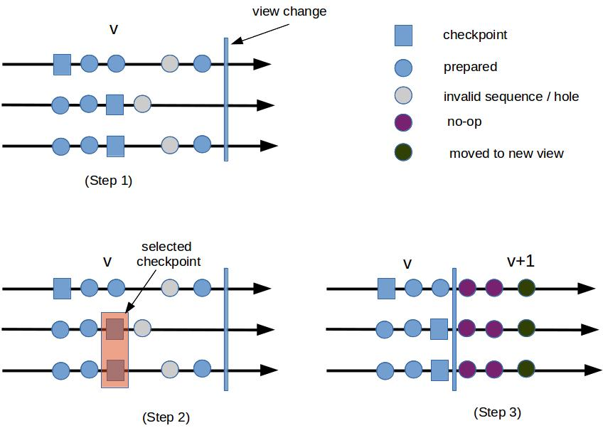
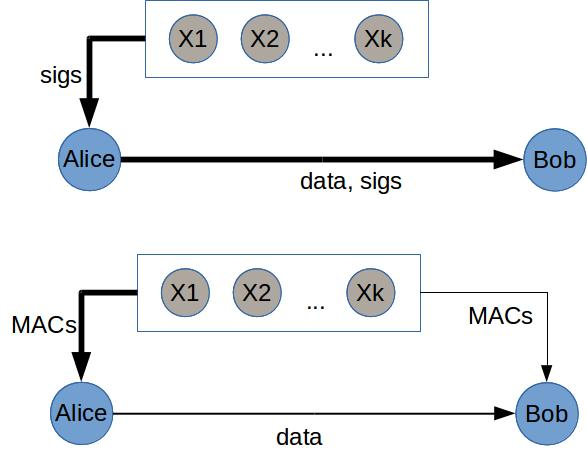

Almost a year has gone by since I sat down and decided to take on Byzantine fault tolerance protocols,
starting with its poster child PBFT. Despite countless reprintings and re-readings the OSDI'99 version of the
paper, I never stop learning new things at every reread. This is party exacerbated by the fact that
Hyperledger Fabric, an open source permissioned blockchain system, contains a Go implementation of PBFT which
serves as the basis for truly understanding the protocol. Discrepancies between the implementation and the
paper bring the protocol's internal intricacies out to the surface. The following summarizes few subtleties I
discovered. 

## Network failure model
Byzantine fault tolerant protocols tolerate at most $$f$$ Byzantine failures. In a distributed system,
however, there are two types of failures: node and network. It is important to distinguish them, especially
since they determine guarantees about the protocol's safety and liveness. 

Node failure means a node (or server, peer, entity, etc.) behaves arbitrarily. This captures the strongest
adversary model. A network failure refers to network partitions which can last for an unbounded amount of
time. It can be quantified as the number of nodes being isolated from the rest of the network, although they
can still communicate with each other. 

Given this distinction, what are being counted toward $$f$$? In PBFT
*  $$f$$ refers to node failures. The protocol **guarantees safety upto $$f$$ node failures**. Safety
is independent of network failure. That is, even if the network is severely partition, namely more than $$f$$
nodes are isolated (*but across all partitions there are still fewer than $$f$$ node failures*), the protocol
is still safe. 

* However, **liveness** is only guaranteed with fewer than $$f$$ total failures, i.e. counting both node and
network failures. This means at least $$2f+1$$ nodes must be reachable. 

Note that safety being independent of network failures is a strong guarantee, and it is common in most variants of
PBFT. Not until  Liu et al. recent work, namely XFT, is it relaxed in a way that separates out node and
network failures. 

## View change
View changes remain the most complex part of PBFT, and it is also a huge factor determining performance, if
not liveness of the system. I am still far from fully understanding view change, but try anyway to explain the
intuition behind its complexity. There are significant difference between MAC-based and signature-based protocols, as
will be made clear later. For this, I will assume that messages are authenticated with signatures. 

View change being complex, it should only be triggered by non-faulty nodes whose timers expired. It means a normal node,
whose timer has not expired, will not join the protocol unless it has sees that $$f+1$$ others have. Once enough nodes
voted for view change, the new leader must decide on the latest checkpoint and ensure, among other things, that
non-faulty nodes are caught up with the latest states, which may involve re-committing (prepare, commit, but no
execution) previously executed requests in the new view. During view change, no requests are processed.   

### View change explains the need for COMMIT phase
View change effectively gives a new node the power of assigning sequence number to requests. It must then ensure that
the new leader does not use old sequence numbers for new requests, either deliberately or gamed into it by
faulty nodes. The safety property of PBFT states that:

> ... the algorithm provides safety if all non-faulty replicas agree on the sequence numbers of requests that
> commit locally

What it implies is if $$(n,m))$$ is committed at a non-faulty node in view $$v$$, the tuple $$(n,m')$$ must
not be committed in view $$v' > v$$ at any other non-faulty replica. The following problem doesn't apply to
non-Byzantine settings which as a consequence needs only two phases (corresponding to Pre-prepare and
Prepare). 

1. In view $$v$$, a non-faulty node $$A$$ receives $$2f+1$$ Prepare certificates for a sequence number $$n$$
attached to message $$m$$. It correctly assumes that $$(n,m)$$ is ordered the same way by $$f+1$$ non-faulty
nodes, including itself. 

2. Thinking that $$(n,m)$$ has been finalized, $$A$$ executes $$m$$ and replies to the client. This response is
backed up by $$f$$ fake responses from the adversary, convincing the client that $$(n,m)$$ was committed. 

3. View change happens. The new leader did not see all $$2f+1$$ Prepare certificates. Neither did the other
$$f-1$$ non-faulty nodes. This could happen due to network partition or effected by the faulty nodes. For
those nodes, $$(n,m)$$ was not prepared and the sequence number $$n$$ is deemed invalid. 

4. The new leader was elected, and it manages to convince other nodes that the last Prepared valid sequence
number from view $$v$$ is $$n-1$$ by collecting enough votes of Prepared certificates from all nodes except
$$A$$. It then moves the $$v+1$$ and start assigning $$(n,m')$$ for $$m' \neq m$$, which is eventually
committed. Safety is violated as the result, since the client see both $$(n,m)$$ and $$(n,m')$$. 

The solution to this is to make sure $$A$$ sees that enough other nodes also received $$2f+1$$ Prepare
certificates. Only then does it execute the request and reply to the client. More specifically, a node sends
out Commit certificate once it collects $$2f+1$$ Prepare certificates. And it considers $$(n,m)$$ committed
only when it receives $$2f+1$$ Commit certificates, i.e. there are $$2f+1$$ nodes each of which sees $$2f+1$$
Prepare certificate. Now, during view change, the new leader cannot convince other nodes that the latest
sequence is $$n-1$$, as there will be at least 1 non-faulty node joining the view change with Prepare
certificate for $$n$$. 

### View change steps

The figure above illustrates high-level steps during view change. Before it starts, a node's state consists
of:

* Checkpoints (squares) which are persisted states. 

* A Prepared certificate (blue circle) for each sequence number $$n$$ greater than the lowest checkpoint. Note
that some 

* Invalid certificate (grey circle) for sequence number are Pre-prepared but no matching $$2f+1$$ Prepare
certificates. This may happen due to network failures or the leader being faulty (it sends conflicting
Pre-prepare messages to different nodes). 

Redo the protocol again, but no execution for one that already committed. 

## Signatures vs. MAC
Singatures are generated with a private key and verified with a public key. In contrast, MACs are generated
using a shared secret. From a system's perspective, they offer different properties:

1. Signatures are often longer (RSA, DSA) and expensive to compute. MACs are cheap.

2. Signatures are publicly verifiable, MACs are only verifiable with the secret key. An important consequence
is that signatures are irrefutable: once Alice signed a message, anyone will be convinced of its authenticity.
On the other hand, MAC cannot be used to prove authenticity, i.e. once Alice generated a MAC for a message
with Bob, Bob cannot use this as evidence that Alice has signed. A third party, Veronica, cannot verify that the MAC is
correct, since he does not know the secret key. Even Bob shares with Veronica the secret, the latter still
does not know whether the MAC is created by Bob or by Alice.  

The first property was what came to my mind when reading a passage in the original paper about alternative
implementations of the protocol. I had quickly dismissed it as merely an implementation choice. I had a second
chance of re-examining it when reading Byzcoin (by Kogias et. al. in Usenix Security 2016), which has one
*optimization* to reduce communication overhead by replacing MAC with signatures. But not until reading
Castro's PhD thesis did I learn the far-reaching implication of the choice between MACs and signatures. No
surprise that the thesis devotes individual section for each of them.

**High-level idea**. During view change of PBFT, the new leader has to prove to other nodes that it has the
right to trigger view change, by bundling view-change requests from other nodes. Furthermore, a node must
prove to another that it has a certain checkpoint, or is able to fetch another checkpoint. This proof is
needed for selecting an initial state from which the new view begins. How to generate such proofs? Using
signatures, a node can collect a set of signed statement from other, i.e. certificates containing the needed
information. It can then show to another node as proof that other nodes have had the information. Since there
is no way to forge signatures, these certificates are sufficient. However, with MAC, the verifying node relies
on non-faulty nodes to broadcast the same information. That is, rather than $$A$$ present to $$B$$ a
certificate as proof of authenticity, it counts on $$B$$ to seeks verifying information from other nodes. The
challenge is for $$A$$ to be certain that $$B$$ will succeed in obtaining such proof. 

### Stable checkpoints
Checkpoints are essentially persisted states. They serve two roles: garbage collection and state transfer.
When a checkpoint is adequately replicated, previous states including messages and certificates can be
discarded. During a view change, a checkpoint is selected as the most recent states most nodes agree on. From
that, some nodes need to catch up (by transferring states from another node) and some requests need to be
re-committed in a new view. 

To fulfill its role, a node collect **checkpoint certificate** from others, and considers a checkpoint $$c$$
*stable* when it is sufficiently replicated and can be reliably retrieved by any other node. 

+ With signatures, $$f+1$$ certificates are sufficient to form a stable certificate. The nodes generating
these certificates cannot deny that they have the checkpoint, because they have signed them. And $$f+1$$
ensure that at least one of them is reachable.  

+ With MACs, $$2f+1$$ certificates (MACs) are needed to form a stable certificate. This is to ensure at least
$$f+1$$ non-faulty node stores the checkpoint, and later on these $$f+1$$ can send the same information to the
verifier to prove the existence of the checkpoint. Suppose Alice collects only $$f+1$$ certificates (one
from itself) before considering the checkpoint $$c$$ stable. The other $$f$$ can be controlled by the
adversary. Later one, when Bob wants to retrieve $$c$$, Alice was partitioned and the adversary claims not to
have it, then the checkpoint is essentially lost. Any number smaller than $$2f+1$$ is not enough, because the
adversary, controlling $$f$$ certificates, can convince the verifier to accept invalid checkpoint.

**Discrepancy notes.** The OSDI version of PBFT described stable checkpoints in MAC mode ($$2f+1$$
certificates), despite it saying in the early part of the paper that it is in the signature modes. Only later
in the paper is it mentioned that the description is actually for MAC mode. 

### View changes

