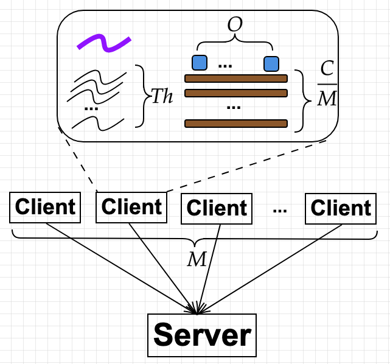

Evaluating performance of a system $$X$$, another fancy name being *benchmarking X*, is as much of an art as a science.
An art because there are many things to measure and report, and because visualizing the results is a creative endeavor.
A science, or more of an engineering nature, because it involves designing, implementing, executing and collecting
experiment results. Any computer scientist worth his salt would also want to automate the above process with complex
scripts.  

Many textbooks are written in this subject, the classic one being "The art of computer performance analysis". However,
there is a big gap between what are covered in books and what are being practiced (or field wisdom). I truly admire
people from systems communities who polish their art through countless practice and real project experiences. If you are
working on a mature field, for example databases or operating systems, chances are high that there are well established
tools and benchmarks, to which you simply add your system as a new *backend*. Let's take LevelDB as an example. It is
storage engine implementing a log structure merge (LSM) tree. It comes with a well written tool, $$db\_bench$$, that
tests various properties of the storage. Suppose you are designing a new LSM storage that significantly improves
LevelDB, you simply modify $$db\_bench$$ and run it with LevelDB and with your system back-to-back. The result is a
clear, clean, and scientifically sound comparison. 

Here I include a few notes on how to conduct sound evaluation of systems offering services over the network. Some of
these are drawn from my own experience, some are learned from papers such as [1] (the fact that papers about experiment
methodlogies and frameworks are still being published at top-tier venue goes to show that people are still struggling
with doing evalution right). Given a server, 
we are going to write benchmarking tools running at clients and issuing requests to it, then measure and report two
metrics: **throughput** and **latency distribution**. For online service, we do not want latency summaries like mean or
median, but the entire distribution because what happening at the tail are very important. When designing evaluation
experiments, there are many variables: number of clients, types of clients (open vs. closed loop), threads per client,
connections per client, request rates, request distribution. How to navigate this space? And that's not it. Another
challenge is how to implement data collection efficiently to avoid interference with the experiments.

I want to emphasize one thing first. The following is true, at least from my experience, whether or not $$X$$ is a
single machine or a distributed systems of many nodes. 

> Most of the resources, in terms of number of machines, are spent on running clients. For example, if you're paying
> for machines on AWE to run your experiments, the clients eat up almost all the budget.  

The above insight did not come to me naturally. I spent most of my PhD time on distributed simulation, and when you want
to evaluate a system with simulation, normally you don't even need a separate client. Also, I may be forgiven for
thinking that the client's tasks are so cheap compared to server's that one is client is enough to saturate the server.
This is true when the server is doing CPU-heavy stuff, for example a HPC server. But for a server offering network
services, it's an entirely different story.  

## Variables
A rule of thumb when doing experiments is: *vary one variable, keep the rest*. If results are plotted against more than
one variables, people will invariably ask which variable is responsible for changes. It is *your* job to avoid people
asking that question.  

Now, in our setting, here are the variables:

Variable | Description 
---|---
$$W$$ | Application logics, e.g, uniform, skewed, read-heavy or write-heavy
$$M$$ | Number of client machines
$$P$$ | Type of client, e.g., open or closed loop
$$Th$$ | Number of threads per client
$$N$$ | Number of global connections (or clients) 
$$O$$ | Number of outstanding request per connection
$$\lambda$$ | Mean arrival rate (time between two requests)

Given an experiment configuration $$E = \langle W, M, P, Th, N, O, \lambda \rangle$$, Figure 1 below depicts how the
variables are implemented. This is the implementation in [1] and [2], but I believe other tools have similar designs.  

**Figure 1** - Client implementation

$$W$$ is easy to deal with by having some switches in the client.
* Each client (each of the $$M$$ clients) launches $$Th$$ threads. There is one control thread (which is the main thread) that coordinates others. 
* Each client starts $$\frac{N}{M.Th}$$ connections to the server per thread.
* Each client has a number of outstanding requests $$O_c < O$$, and can send only when $$O_c > 0$$ (it is called *available*).  
* Each thread does the following in an infinite loop:
   + It pick a connection that is available, send, and decreases that connection's $$O_c$$. 
   + If a response is received in a connection, it updates the corresponding $$O_c$$. 

## Load vs. Workload
One of my ah-ha moments is to realize that load is different to workload. 
* Load: the number of requests received at the system. This should be varied. Note that I consider *load* as what the client
generates, which may differ to what the system experiences. The latter is called **offered load**. Sometimes, the client
may think it generates a high load, but what received is actually very small. 

* Workload: the characteristics of requests, plus the mechanics of generating load. **This is fixed**
(per set of experiments). In the past, when people say read-heavy vs. write-heavy workload, they refer to
characteristics of the request distribution. But when they say Visa workload vs. cryptocurrency workload, what they mean
is load.  

## Load Generator
We want to generate load such that it approximates how the system would be used in practice. Therefore, a load generator
typically falls into two categories. In this section, I use "clients" and "connections" interchangably. I will
revert to their original meaning when discussing experiment design (next section). 

* **Closed-loop:** there are $$N$$ clients, each sends a request, blocks until it receives a response, then thinks for time
$$Z$$, then sends again. This model resembles what happens at (deep) backend servers, like databases or key-value
stores. As will be made clear later, these servers have strict admission control, and their utilization/loads are
carefully monitored. 

* **Open-loop:** the is an infinite number of clients, $$N = \infty$$. An open-loop client first sends a request, wait
for appropriate inter-arrival timeout, then sends a new request. Note how it doesn't wait for the request to finish
before issuing a new one. This model reflects what happen to a user facing service, like a web server, which does not
want to reject users.   
 
So the question is: which model do you choose? Beside These models have a number of interesting properties. 

### Both models can issue the same load
People have been analyzing these two models with queue theory. An excellent note on the theory is by Donald Krossmman
[5], so good that it's worth making a digression here. 

---
\begin{digression}
#### Queue theory
Let $$\lambda$$ be the **mean** arrival rate, $$\mu$$ be the server's **mean service rate** (how many requests leave the
system per second, or throughput), $$R$$ be the response time which includes both service time and queueing time. Note
here that $$R$$ is different to service time which is $$\frac{1}{\mu}$$. Gil Tene gave a good rant on the distinction
in [4]. Then Little's Law says that, regardless of the distribution of any of the random variables:

$$L = \lambda.R$$

where $$L$$ is the **mean** number of requests in the system. $$L$$ includes both requests being queued and ones being
serviced. 

#### Operational laws
Little's Law is remarkably simple, given the number of hidden details that need to be satisfied before one can
use that beautiful equation. 

1. All $$L, \lambda$$ and $$R$$ are *random variables*. That is, they are outputs of certain stochastic
processes. 

2. Such stochastic processes are stationary, i.e., distributions of these random variables are unchanged. They
are also ergodic: they converge to some value over time.

3. The request are from a Markov process.

4. The system is at equilibrium. I'm not hundred percent sure what it is, but would guess that it is at that
converged state of the stochastic processes. 

To use Little's Law in its original form in practice, one must justify all these five condition holds for the
system under consideration, which is a hard ask. Even if these are true, the law only holds over **infinitly
observed sequence of values**. It means for a finite period of observation, the law is almost always useless. 

What a mortal scientist actually does in practice is to observe the system for time $$T$$ and measure some
quantities (or variables). And what he cares most is to derive precise mathematical equations between these
variables. Precise as opposed to probabilistic. These equations are called **operational laws**, and they are
considered *fundamental laws of computer performance* [6]. We are probably using it all the time without ever
realizing. 

|Variable | Description | Value |
|---|---|---|
|$$T$$ | Observation period | Fixed |
|$$A$$ | Number of arriving requests | Measured |
|$$B$$ | Amount of time the system is busy | Measured |
|$$C$$ | Number of completions (requests leaving the system) | Measured |
|$$\lambda$$ | Arrival rate | $$\frac{A}{T}$$ |
|$$X$$ | Throughput | $$\frac{C}{T}$$ |
|$$\mu$$ | Service time | $$\frac{B}{C}$$ |
|**$$U$$** | **Utilization** | **$$\mu.X$$** |
|$$R$$ | Response time per request | Measured |
|**$$N$$** | **Number of requests in the system** | **$$X.R$$** | 

For example, suppose we observe that a disk can service $$X = 50$$ requests per second, and that each requests
takes $$0.01s$$, then the utilization is $$50.0.01 = 0.5$$. Suppose that an user observes a response time of
$$0.4s$$, then there are in average $$50.(0.4) = 20$$ requests in the systems.  

#### Reconciling operational laws with Little's law
The last law above looks strikingly similar to Little's law. We can reconcile
them by making a simple assumption.

> Flow balance assumption: $$A = C$$

This assumption is easy to test: just measuring them during T. And you can easily choose $$T$$ long enough
that it is true with a very high probability. So this is considered true by default. With this, we have

  $$N = X.R = \lambda.R$$ 

Another direct mapping from an operational law to Little's is the utilization law. Suppose there is no queue,
the number of requests in the system is either $$0$$ (when the system is not busy), or $$1$$ when it is busy.
Furthermore, $$R = \mu$$ because of no waiting time. Then utilization, being the average time when the system
is busy, is exactly $$L$$. In other words: 

$$U = L = \lambda.\mu = X.\mu = X.R$$. 
    
**Important use of operation laws.** They are extremely useful as a consistency check: whether the
measurements reported are consistent with each other. For example, a paper describes an experiment with $$N$$
clients, then reports some numbers for throughput and latency. A sanity check is that the values satisfy
$$N=X.R$$. If not, clearly something is wrong. Another popular use of operational laws is to compute value of
a third value givens the other two.  For instance, service time $$\mu$$ and throughput may be easier to
measure than utilization, but we can apply $$U = \mu.X$$ to compute utilization. 

#### What is load?
Recall that load is the number of requests sent to the systems, or $$\lambda$$. Under the flow balance
assumption (which is true by default, or by careful selection of $$T$$), $$\lambda = X$$. $$U$$ can be
interpreted as scaled offered load (normalized by $$\mu$$). The system is only interesting when $$U \in
[0,1)$$. When $$U > 1$$, meaning that $$\lambda > \frac{1}{\mu}$$, the system is unstable because the queue
grows to infinity. $$U = 1$$ is a possibility, but it is a bad idea pushing the system to this state [4],
because by randomness some values will push the systems over the edge. 

> It is useless to study how the system behaves when it saturates, you only want to push that saturation point
> further, or to make sure that performance before saturation is good enough.  

\end{digression}

---

Now with this fundamental law, $$N = X.R$$, the load is $$X$$. However, its interpretation is different based
on whether the system is open or closed loop. 

* For closed loop, we can only control $$N$$ and $$Z$$. $$X$$ and $$R$$ are measurable quantities of the
system. The load $$X$$, which is also the throughput, is given by $$X = \frac{N}{R+Z}$$. The system is
self-stabilizing, that is, you can increase $$N$$ to be very high, but then $$(R+Z)$$ will also increase such
that $$X$$ remains as its peak value. This suggests an easy way to measure the system's peak throughput: $$N$$
is the proxy for load, increase it will increase the load until it reaches the peak throughput, after which
the throughput will not increase. Here is what it looks like

*Figure 2 - Varying $$N$$ to find peak throughput. $$Z = 0$$ for simplicity.* 

We can check for consistency of the two figures by using the operational law. This same graph also illustrates
*connection scalability*, as the system often incurs overheads for each connection. Indeed,
throughput decreases after the peak because of overhead in handling many concurrent users/connections.  

* For open-loop, we can control $$\lambda$$. $$L$$ and $$R$$ are measurable quantities. In a closed-loop
generator, when we fix $$N$$, there is always $$N$$ requests in the system. But in an open-loop system, fixing
$$\lambda$$ only guarantees the **mean** number of requests in the system, thus there can be more than $$L$$
at a given time. Under open-loop, the system can be come unstable. That is, we cannot increase $$\lambda$$
forever, because as soon as $$\lambda > \frac{1}{\mu}$$ both $$L$$ and $$R$$ grow without bound. Remember the
utilization rule discussed earlier. Here is what it looks lie.  

*Figure 3 - Varying $$\lambda$$.* 

Compare this to Figure 2, and see how response time shoots up to infinity at the knee, as opposed to growing
(super-)linearly with $$N$$. 

### Their latency distributions are different
We have seen that open and closed loop generators behave differently at and beyond saturation. How about
before saturation, i.e. $$U < 1$$. We are specifically interested in tail latency, which is very important at
scale. Before moving on, 

> Latency is only meaningful under a given load. That is, when comparing latency of two systems, they must be
> under the same load.

The tail latency is a function of maximum queue length. In closed loop, there can only be a maximum of $$N$$
requests, so the tail latency is bound by $$N$$. In open loop, $$L$$ is a function of $$\lambda$$ which is a
mean of a random variable. If the distribution is uniform (or fixed), then $$L$$ is a constant. However, in
practice it is often a Poisson distribution, which has no bound on the maximum number of requests per second: there
can be a time (very rare) when many many requests arrive at the same time. It means the worst queue length can
be very large, which means the worst latency has no bound. Because of this, for system handling with open-loop
requests, people are mostly interested in the magnitude of the $$99.99%$$ latency.

*Figure 4 - queue length distribution. Lifted from [3]*.

Figure 4 illustrates queue length distributions for closed loop and open loop. For the former, the CDF reaches
$$1$$ at the exact number of connection. In contrast, for the open loop, the CDF has much longer tail it seems
to never reach $$1$$. Another important observation is that increasing $$N$$ pushes the curve further to the
right. 

> It is proven that open loop latency is the limit behavior of closed loop latency, as $$N \to \infty$$. 

## Two Experiments You Must Do. And How to Do It
When evaluating a system, or comparing multiple ones, two things you must at least show people are peak
throughput and latency under various load. 

### Determining peak throughput 
What you want to show is Figure 2: varying $$N$$ and measure throughput. Ideally, you would have as many
machines as possible to push the load to the peak throughput, i.e., $$M = N$$. But resource constraints means
$$M << N$$, therefore each machine must create multiple connections.  Maintaining one connection, however, is
not cheap, and we do not want the client to be the bottleneck. In particular, we cannot cram a large number of
connections to one clients because the CPU will then be busy switching between them rather than doing real
work (of sending and receiving messages). Suppose you have created as many connection as possible per machine
but it is still not enough, then what to do?. The trick here is to have more than 1 outstanding requests per
connection, to make it look as if there are more connections. 

Suppose we have $$M$$ physical machines as clients, and through offline benchmark we know that each client can
have up to $$C_{max}$$ connections and $$O_{max}$$ outstanding requests per connection. I would plan my experiment as follows:

0. Set $$c=1, O=1$$

1. Increase the number of clients from $$0$$ to $$M$$ and measure the throughput. 

2. If the pattern looks like Figure 1, we finish.

3. If $$c < C_{max}$$, we increase the number of connection per clients, c++, then go back to Step 1. 

4. If $$O < O_{max}$$, we increase number of outstanding requests per connection, $$O++$$, then go back to Step 1.  

5. We don't have enough resources. Acquire more!

At the end of this set of experiments, we should be able to say what the peak throughput is, what the value of
$$N, O$$ at that peak, and whether the system is scalable with respect to the number of connections.  

### Showing latency under varying load 
The purpose of this experiment is to show tail latency as a function of load, i.e. we want to show something
like the blue line of Figure 5 below. 

*Figure 5 - Tail latency as a function of load. Redrawn based on a figure in [1].*

Recall that we want to generate open loop loads in order to achieve realistic tail latency. Once the desired
load is attained, a closed loop client can issue requests and measure latency. It seems clean and easy to have
distinct load and latency client. 

**Writing an open loop load generator**

Imaging writing an open loop load client. That client would:

* Create a connection $$c$$ to the server. 
* It would send a request according to interval $$\lambda_c$$, such that the global load is $$C.\lambda_c$$. 

One client isn't enough, because it cannot generate request fast enough when high load is required. Even if
there are enough clients and CPUs to keep up with the rate, client's limited bandwidth may lead to request
queueing, therefore introducing **client bias** to the load received by the system. To overcome this, we need
to have enough client machines to create a sufficiently large number of connections to the server. 

**Generating open loop load with closed loop clients**

One important theoretical results mentioned earlier is that behavior of a closed loop system with large $$N$$
approaches that of an open loop system. So if there are enough client machines, we can use the closed loop
client described earlier. 

**The choice of client**

Given these two options, both Lancet and Mutilate use closed loop client. One argument for this has been that
closed loop implementation is more simple, but I think it is not entirely true. In fact, open loop may be
less complex because each connection doesn't have to keep track of how many more outstanding requests it can
send. Nevertheless, there are practical reasons to choose a closed loop implementation. First, even in closed
loop we need to use a large number of $$N$$ to saturate the system, so large that its behavior already
approximate that of an open loop. Second, there is a greater degree control in closed loop, since we can bound
the maximum resource at the client in terms of $$Th, C, M, O$$. In contrasts, the maximum resource needed for
open loop has no bound, because for each $$\lambda$$ the maximum rate is $$\infty$$. 

**Extending closed loop client**

We modify a closed loop client to support open loop load as follows. 

* All the setups of threads, connections stay the same. 

* Each *thread* per client machine now has a random number generator that generate inter-arrival time with the mean
$$\frac{\lambda}{M.Th}$$. 

* Each thread uses that random number generator to set a time in the future for the next message, next_ts. 

* Each thread then does the following in an infinite loop:
  + If the current time passes next_ts:
     - It picks an available connection (whose $$O_c > 1$$) and sends it.
     - It updates next_ts
  + If a response is received on a connection, it updates the corresponding $$O_c$$.
  + Otherwise, it spins. 

**Experiment design**

Having decided to use closed loop clients to simulate open loop load, the experiment plan now goes like this:

1. Use the previous experiment to select $$N, O$$ that achieve peak throughput. Note here that the minimum
values are ones **at** the saturation point. However, if we have large enough $$M$$ such that $$O=1$$ and
$$\frac{N}{M} < C_{max}$$ then we can choose a higher $$N$$, i.e. beyond saturation. The reason is that we
want as large $$N$$ as possible. But not too large, only as long as it does not lead to throughput drop.
Many systems exhibit a throughput pattern that increases to the peak, plateaus there for while, and then
drops. 

2. For each value of $$\lambda in [0, \lambda_{max}]$$, measure the tail latency. 

3. Plot the result. 

Step 1 is extremely important, because what are selected at the end, namely $$N$$, is part of of the workload.

> Number of connections is part of the workload, i.e. fixed for the latency experiments.  

The red line of Figure 5 illustrates a problem when Step 1 is not followed strictly: $$N$$ is too small. When
$$N$$ is below the saturation point in Figure 2, even if we push $$\lambda$$ to the peak throughput, the
*actual* load generated is still not enough to saturate the system. When $$N$$ is sufficiently large, we
should expect a knee as in Figure 3 or the blue line in Figure 5. Instead, the red line stays almost constant,
leading to a wrong conclusion, that the peak load is somewhere further to the right.

It does show one correct behavior, though. As load increases, having more connections better estimate open
loop tail latency (which should be higher than closed loop latency). 

## Acknowledgement
I learned a lot from personal correspondence with the authors of [1]. Just want to give them another
shout-out for releasing the source code.   

## References
[1] Marios Kogias et al. Lancet: A self-correcting Latency Measuring Tool. Usenix ATC 2019

[2] Mutilate: high-performance memcached load generator. https://github.com/leverich/mutilate

[3] Treadmill: Attributing the Source of Tail Latency through Precise Load Testing and Statistical Inference. ISCA 2016

[4] How to measure latency (Strange Loop)

[5] Queuing theory https://www.systems.ethz.ch/sites/default/files/file/Spring2013_Courses/OSN_Spring2013/Lectures/5_chapter5-Queues.pdf

[6] The operational analysis of queuing network models
