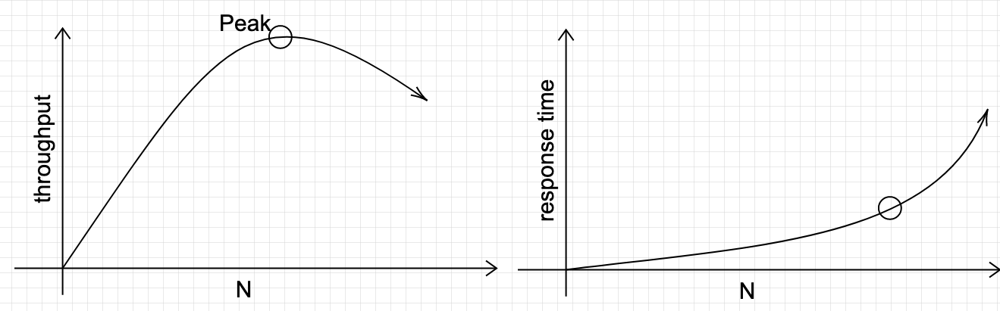

Evaluating performance of a system $$X$$, another fancy name being *benchmarking X*, is as much of an art as a science.
An art because there are many things to measure and report, and because visualizing the results is a creative endeavor.
A science, or more of an engineering nature, because it involves designing, implementing, executing and collecting
experiment results. Any computer scientist worth his salt would also want to automate the above process with complex
scripts.  

Many textbooks are written in this subject, the classic one being "The art of computer performance analysis". However,
there is a big gap between what are covered in books and what are being practiced (or field wisdom). I truly admire
people from systems communities who polish their art through countless practice and real project experiences. If you are
working on a mature field, for example databases or operating systems, chances are high that there are well established
tools and benchmarks, to which you simply add your system as a new *backend*. Let's take LevelDB as an example. It is
storage engine implementing a log structure merge (LSM) tree. It comes with a well written tool, $$db\_bench$$, that
tests various properties of the storage. Suppose you are designing a new LSM storage that significantly improves
LevelDB, you simply modify $$db\_bench$$ and run it with LevelDB and with your system back-to-back. The result is a
clear, clean, and scientifically sound comparison. 

Here I include a few notes on how to conduct sound evaluation of systems offering services over the network. Some of
these are drawn from my own experience, some are learned from papers such as [1] (the fact that papers about experiment
methodlogies and frameworks are still being published at top-tier venue goes to show that people are still struggling
with doing evalution right). In particular, $$X$$ is a server, and
we are going to write benchmarking tools running at clients and issuing requests to $$X$$, then measure and report two
metrics: **throughput** and **latency distribution**. For online service, we do not want latency summaries like mean or
median, but the entire distribution because what happening at the tail are very important. When designing evaluation
experiments, there are many variables: number of clients, types of clients (open vs. closed loop), threads per client,
connections per client, request rates, request distribution. How to navigate this space? And that's not it. Another
challenge is how to implement data collection efficiently to avoid interference with the experiments.

I want to emphasize one thing first. The following is true, at least from my experience, whether or not $$X$$ is a
single machine or a distributed systems of many nodes. 

> Most of the resources, in terms of number of machines, are spent on running clients. For example, if you're paying
> for machines on AWE to run your experiments, the clients eat up almost all the budget.  

The above insight did not come to me naturally. I spent most of my PhD time on distributed simulation, and when you want
to evaluate a system with simulation, normally you don't even need a separate client. Also, I may be forgiven for
thinking that the client's tasks are so cheap compared to server's that one is client is enough to saturate the server.
This is true when the server is doing CPU-heavy stuff, for example a HPC server. But for a server offering network
services, it's an entirely different story.  

## Variables
A rule of thumb when doing experiments is: *vary one variable, keep the rest*. If results are plotted against more than
one variables, people will invariably ask which variable is responsible for changes. It is *your* job to avoid people
asking that question.  

Now, in our setting, here are the variables:

Variable | Description 
---|---
$$A$$ | Application logics, e.g, uniform, skewed, read-heavy or write-heavy
$$N$$ | Number of clients
$$S$$ | Type of client, e.g., open or closed loop
$$T$$ | Number of threads per client
$$C$$ | Number of connections (globally, not per client)
$$O$$ | Number of outstanding request per connection
$$\lambda$$ | Mean arrival rate (time between two requests)

Given an experiment configuration $$E = \langle A, N, S, T, C, O, \lambda \rangle$$, Figure 1 below depicts how the
variables are implemented. This is the implementation in [1] and [2], but I believe other tools have similar designs.  

**Figure 1** - Client implementation

$$A$$ is easy to deal with by having some switches in the client.
* Each client (each of the $$N$$ clients) launches $$T$$ threads. There is one control thread (which is the main thread) that coordinates others. 
* Each client starts $$\frac{N}{C}$$ connections to the server.
* When sending message, each thread will pick an available connection in the pool to send.
* Each connection has a maximum of $$O$$ outstanding requests. That is, after sending a requests on connection $$c$$,
that connection's number of outstanding request $$O_c$$ is incremented by 1. When receiving a reply, $$O_c$$ is
decremented by 1. The client can only send on $$c$$ if $$O_c < O$$. 

## Load vs. Workload
One of my ah-ha moments is to realize that load is different to workload. 
* Load: the number of requests received at $$S$$. This should be varied.
* Workload: the characteristics of requests, plus the mechanics of generating load. **This is fixed** (per set of
experiments). In the past, when people say read-heavy vs. write-heavy workload, they refer to characteristics of the
request distribution. But when they say Visa workload vs. cryptocurrency workload, what they mean is load.  

**Figure 2** - Impact of the number of connections $$C$$ on number of outstanding requests (left) [3], and tail latency (right, modified from [1]).  

### What about $$\lambda$$?
$$\lambda$$ is the **global** request arrival rate. It captures **load** on the system. For example, $$\lambda=0.001s$$
means $$S$$ receives $$1000$$ requests per second. This *request rate* is not the full story. People also care about
*request distribution* since it directly affect tail latency. In practice, two distributions are used:

1. Uniform: requests are sent at a fixed rate, i.e., $$\lambda$$.

2. Poisson: requests are sent in a bursty manner, following a Poisson distribution. That is, the interval between two
requests follows an exponential distribution with mean $$\lambda$$.   

The first distribution is easier to deal with: the queue at the server is quite stable, and so is the tail latency.
With Poisson distribution, however, there are period of times when a lot of requests arrive at the same time, creating a
long queue, which effectively increases tail latency. Poisson distribution is known to approximate real-world queueing
behavior, thus it is used quite often to study tail latency. 

### Notes on open vs. closed loop client

## What You Want to Show

**Figure 1** - Throughput scalability

**Figure 2** - Throughput vs. latency

Given $$X$$, Figure 1 and 2 are the two most important figures you want users/reviewers/developers to see. Let's forget
the $$x$$ axis for now, and focus on the meaning conveyed by these figures. Using Figure 1, you want to show a peak
throughput 

## The Right Experiments

## References
[1] Marios Kogias et al. Lancet: A self-correcting Latency Measuring Tool. Usenix ATC 2019

[2] Mutilate: high-performance memcached load generator. https://github.com/leverich/mutilate

[3] Treadmill: Attributing the Source of Tail Latency through Precise Load Testing and Statistical Inference. ISCA 2016
