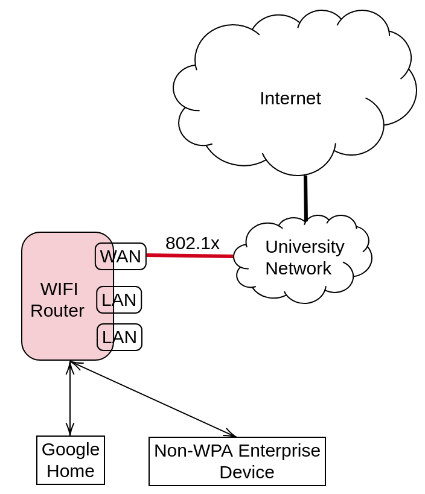
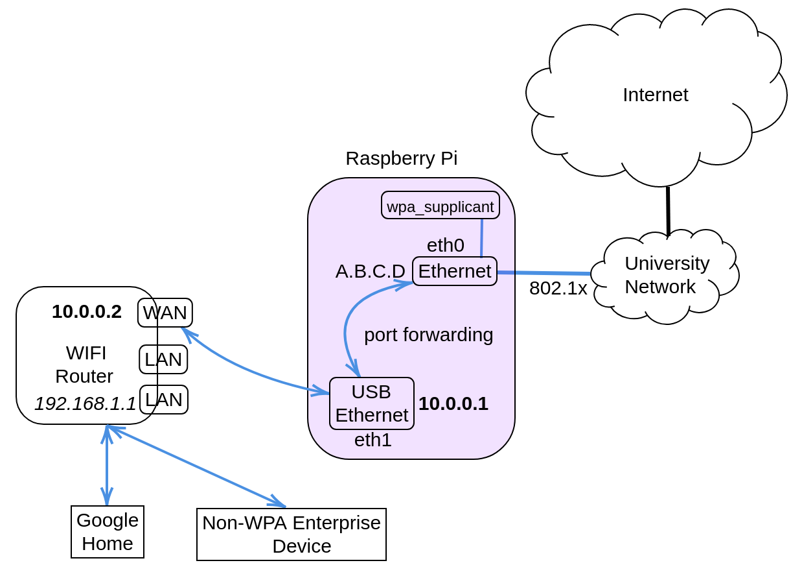

I am very proud of my Google Home. My son loves her as she plays him ABC and
The Wheel on the Bus everyday. I took every opportunity to show her off to
house guests. But that was before I moved to an university accommodation and
relinquished the previous residential Internet connection. The university has
WIFI coverage in the house, and provides several LAN ports on the wall. I
plugged her in, and to my horror discovered that she does not work with WPA2
Enterprise Wifi network. And it's not just her, other smart TVs aren't likely
to work either. They are not designed for networks with stringent security
protection. 

Digging around, I found the major different between WPA2 Enterprise, commonly
found in university and most enterprises that have something to protect, versus
WPA2 personal, ones that are built in residential routers, is 802.1X. This is a
port-based authentication protocol and works roughly as follows:

1. You plug your machine into the wall LAN port. That port is connected to a
switch somewhere. That switch doesn't let packages through unless the port is
authenticated. 

2. You enter your assigned credentials, that is sent to an authentication server. 

3. The authentication server checks if you are allowed in the network, then replies so to the switch. 

4. If the response is positive, you're connected. 


Compared to WPA2 Personal, where you set up a pre-shared key (PSK) and tell
everyone who needs it, 802.1X has stronger security. First, it decouples
authentication from access: whoever knows PSK can access your home network, but
not everyone having accounts in the enterprise system can access the network.
Second, revocation is simpler: to revoke one access with PSK you have to
change the key and tell everyone else, but with 802.X you simply tell the
authentication server. 

Your connection to the network is identified and authenticated by the LAN port
you're connecting too, and also by the MAC address of your computer. Without
the latter, the port only needs to be authenticated once, then any rouge
machine can be plugged in. 

> The caveat with 802.X is that authentication is done only when a new
> connection is established. Meaning that if you never logged out (or your LAN
> cable got unplugged), then you'll remain connected.  

Spoiler alert! This caveat came back to bite me later. 

## First Try. Failed!



Understanding that GoogleHome needs a WPA-Personal network, I bought a Wifi
router. The idea is to set up a WPA2 network like the figure above. Ideally, the router does two things:

1. It connects to the university wired network.

2. It acts as an access point, broadcasting Wifi to the house. Of course it won't be using WPA2 Enterprise.

Then my GoogleHome can just connect to it. Lo and behold, it doesn't work.  

Turns out that routers (I bought an **Asus RT-N12D1** model, not expensive but not so
cheap either) are so dumb that they don't talk 802.1X over the WAN connection.  

#### Cloning doesn't work
My next step was trying to clone MAC address of the laptop that has been
successfully authenticated. My reason is that the authentication is based on
(port, MAC) tuple, so if the router has the same as the laptop then it should
work. But NO. Once I plug the cable out of the laptop, connection is reset so
that the next one (plugged to the router) will again go through 802.1X
authentication process. Cloning doesn't help. 

#### Hacking the router doesn't work
A colleague then told me to hack the router. That feeling you have when
successfully install new firmware on the router, or flashing it, and being able
to SSH in, was extremely powerful and addictive. No wonder some people loves
working with hardware. But that feeling quickly evaporated and was replaced by
frustration.  

Many years ago I heard of friends talking about replacing router software with
customized operating system. The process seemed a lot of work, and my
understanding then was that only a few expensive routers would let you do that.
Now though, even the cheapest ones, like D-Links, are capable of running
open-source router OS. Looking at the list of devices supported in some of
these OS makes you appreciate the effort of the open source community.
Unfortunately for my case, none of the popular router OSes works. 

* *OpenWRT:* does not have (stable) support for Wifi hardware in my router. It
means the best I can get is a non-Wifi router connected to the university
network. But GoogleHome doesn't have LAN connection. So this option is off the
table, even if the router can authenticate using 802.1X. And of course it
doesn't authenticate. The standard method to do 802.1X authentication is with
`wpa_supplication` tool, which timed out for me. The tool has no debugging
capability that can help me understanding why. So I gave up.    

* *DD-WRT:* the most popular alternative to OpenWRT, which claimed to have Wifi
support for my router model. However, I never got further than logging in via
SSH. Even though `wpa_supplicant` was there and owned by `root`, there were
always errors, either "permission denied", or "command not found". I even went
through the process of compiling new kernel to install the latest version of
`wpa_supplication`,but to no avail. There was not enough documentation online
to help me through it. With other work commitments coming up, I literally
shoved the whole thing to the cabinet, cursing it while doing so.  

## Then Came The Light



Epiphany came in the form of little Raspberry Pi. It was the combination of two observations:

1. The problem with OpenWRT is that it cannot authenticate through 802.1X. My
desktop, running Ubuntu, can. The difference is the OS: one is minimal, other
is the full-fledge Ubuntu.  

2. A Raspberry Pi is:
	+ Cheap
	+ Can run full-fledge Ubuntu
	+ Has LAN ports. 

A possible setup is shown in the figure above. The Raspberry Pi will be a
gateway that connects to the Internet. There will another LAN port in the
device, which is connected to the WAN port of the router. This setup 
resembles that of a private cluster where the head node typically has 2 LAN ports, one
connecting to Internet, another to a switch to which other slave nodes are
connected. The head node is then configured so that traffic coming from the
cluster will be NAT-ed through the Internet-connecting LAN port.  

## Detailed Steps
Here are the steps that finally work. 

1. Go buy a USB-LAN port, so that the Raspberry Pi has two Ethernet connections: eth0 (built-in), and eth1. 

2. Install latest Raspbian OS on it, using the version that include all libraries. I used `Buster with desktop and recommended software`.  

3. Configure `eth1` to be a gateway on `10.0.0.0/8` network:

	+ Edit `/etc/network/interfaces` with the following:
```
auto eth1
iface eth1 inet static
address 10.0.0.1
netmask 255.0.0.0
```

	+ Edit `/etc/resolv.conf` to include the default DNS:
		```
		nameserver 8.8.8.8
		```

4. Configure port forwarding between `eth0` and `eth1`:
	+ Edit `/etc/sysctl.conf`
		```
		net.ipv4.ip_forward = 1
		```
	+ Add the following to `/etc/rc.local` (before exit 0):
		```
		iptables -A FORWARD -i eth1 -o eth0 -j ACCEPT
		iptables -A FORWARD -i eth0 -o eth1 -m state --state RELATED,ESTABLISHED -j ACCEPT
		iptables -t nat -A POSTROUTING -o eth0 -j MASQUERADE
		```
   After this, all connection from `eth1` to the outside world will be NAT-ed through `eth0`. 

5. Get `eth0` to authenticate:
	+ Edit `/etc/config/wpa.conf`:
		```
		ctrl_interface=/var/run/wpa_supplicant
		ctrl_interface_group=root
		ap_scan=0
		network={
			key_mgmt=IEEE8021X
			eap=MSCHAPV2
			eapol_flags=0
			identity="<usename>"
			password="<password>"
			phase1="peaplabel=1"
			phase2="auth=MSCHAPV2"
		}
		```
	+ Then add the following to `/etc/rc.local`:
		```
		wpa_supplicant -D wired -i eth0 -c /etc/config/wpa.conf &
		```
	You can try out the command first, the log of which should say that authentication is successful. 

6. Configure WAN port on the router: simply log in to the router at `192.168.1.1` and set up static WAN address:

	+ Its IP belongs to the `10.0.0.0/8` network.
	+ The gateway is `eth1` at the Raspberry Pi, i.e., `10.0.0.1`
	+ DNS is the default `8.8.8.8` 

## Epilogue 

Me: OK Google. Good afternoon!

GH: Hi, Anh. I see that you have a new greeting routine. 

Me: ...

No how you doing, no long time no see, no I miss you. What a heartless piece of ...!
