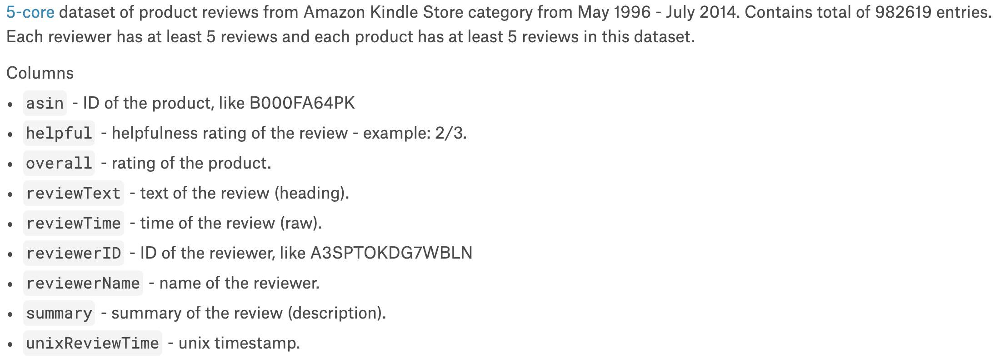
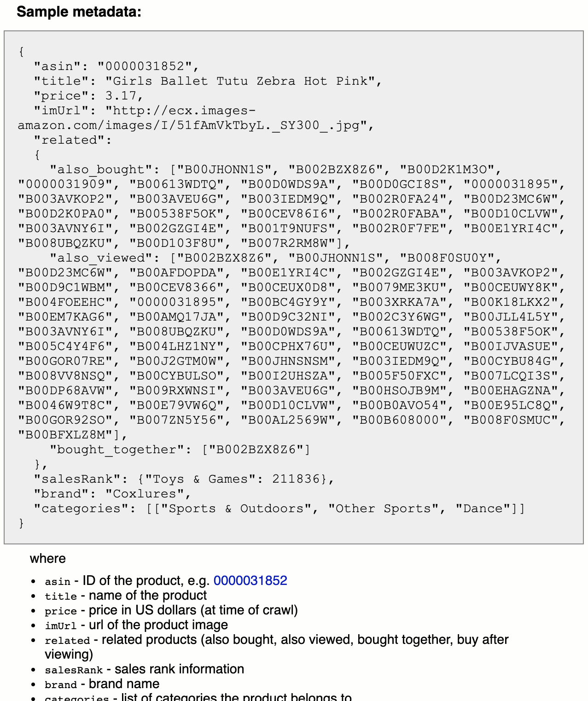
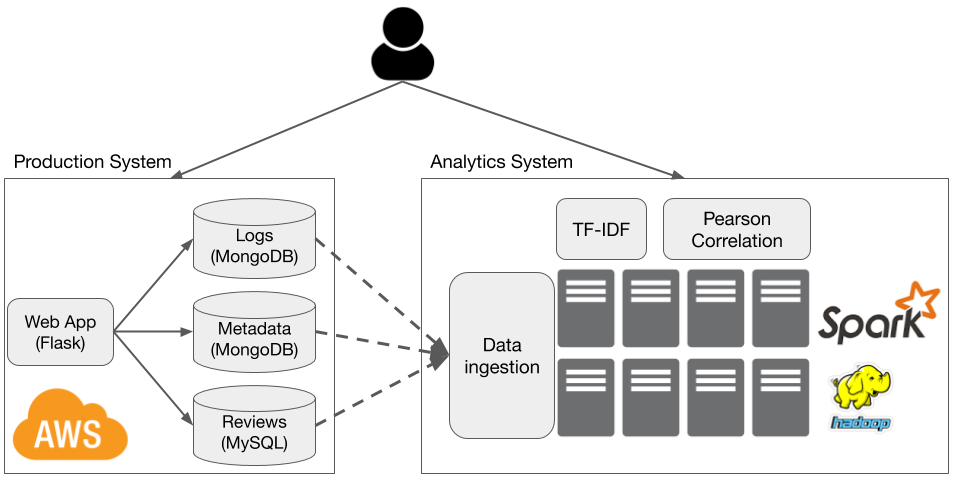

# Group Project (25%)
In this project, you will build a web application for Kindle book reviews, one that is similar to
[Goodreads](https://goodreads.com). You will start with some public datasets from Amazon, and will design and
implement your application around them. The requirements below are intended to be broad and give you
freedom to explore alternative design choices.  

* [Project groups](#groups)
* [Dataset information](#dataset)
* [System requirements](#system-requirements)
* [Implementation requirements](#implementation-requirements)
* [Submission](#submission)
* [Grading scheme](#grading-scheme)
* [Checkpoints](#checkpoints)
* [FAQs](#faqs)

<h4> Deadline: Sunday 6th December, 23:59pm </h4>

 
### Groups
You must do this in groups. Each group has 3 to 5 members. 

[Sign up for your group
here](https://docs.google.com/spreadsheets/d/1U1ZFdk0Lt4zmXLtAu5RYnECMVxrtWFrBLBkG8uOop5I/edit?usp=sharing)

 
### Dataset 
You will be using two dataset. 
+ Amazon Kindle's reviews, available from [Kaggle website](https://www.kaggle.com/bharadwaj6/kindle-reviews). 

  

  This dataset has 982,619 entries (about 700MB).

+ Amazon Kindle metadata, available from [UCSD website](http://jmcauley.ucsd.edu/data/amazon/)

  

  This dataset has 434,702 products (about 450MB)

**WARNING** There are some weird characters in these datasets that cause troubles to the loading tools in
MySQL and MongoDB. I have manually removed them, and uploaded the *clean* datasets to AWS. You can download
them using this script [get_data.sh](assets/scripts/get_data.sh). 

 
### System Requirements
You will implement an end-to-end web application, like below. 

The production system handles *online* requests from users, such as adding, removing books. This system is
expected to be long-running. The analytics system ingests data from the production system,
and runs complex analytics tasks. Both ingestion and analytics are triggered at regular interval, for example,
every day, or upon user request. 

#### Production System
This system has the following features. 
+ A front-end with at least the following functionalities:
  - Add a new book
  - Search for existing book by author and by title. 
  - Add a new review
  - Sort books by reviews, gernes. 

+ A relational database storing reviews.
+ A non-relational database storing web logs (activities from users).
+ A non-relational database storing book metadata.  

#### Analytics System
This system consists of a cluster of servers, and support the following features:
+ Loading data from the production system, and store in a distributed file system. 
+ Implementing two analytics tasks:
  * *Correlation*: compute the Pearson correlation between price and average review length. 
  * *TF-IDF*: compute the [term frequency inverse document frequency](https://en.wikipedia.org/wiki/Tf%E2%80%93idf) metric on the review text. Treat one review as a document.  
+ Scaling up and down (adding or removing nodes). 
 
 
### Implementation Requirements
Your systems must run on AWS. You must automate the setting up of the entire system using scripts. Please read
the following requirements carefully. 

* Cloud environment:
  + You cannot use managed services such as EMR, RDS, Kubernetes. 
  + You must start from the most basic OS image, for example `ami-04613ff1fdcd2eab1`. Only the most basic OS packages are installed in this image.
  + You can use Cloud Formation.

* Automation script: you can write your script in any language. You can have multiple scripts. The script must do the following: 
  + Take an AWS credentials as input. For the analytic tasks, your script also take the number of nodes.
  + Spin up new instances from a base Ubuntu image (one having only basic OS packages).
  + Configure and start your systems (both production and analytics). Return the URL of the front end.
  + Have options to start the ingestion and analytic tasks.
  + Results of the analytic tasks can be saved to file (if too large). In this case, return the URL for
  accessing the results. 
  + Have options to tear down all systems. 

* Production systems:
  + You can choose any front-end framework. 
  + You can choose any relational databases, not necessarily MySQL. 
  + For non-relational databases, you must use a document store. MongoDB is recommended.  
  + A log record must have at least the following information:
    - Timestamp
    - Type of request
    - Response code (404, 200, etc.)

 
### Submission 
You must create a private Github repository and invite the instructor before the deadline. 
* Your repository must contain documentation on how to use the code. 
* <h6>Important:  You must not make the repository public.</h6> 

 
### Grading Scheme
Your project is graded based on what you submit, and a live demonstration of the project. 

* 20 points for: 
  + Functional automation scripts that set up and tear down the systems.
  + Functional systems implementing the required features.
* 2 points for:
  + User-friendly front-end
  + Extra features in the front-end
* 2 points for:
  + Automation scripts (easy of use, how much is automated)
  + Code quality
  + Speed (how fast the analytics tasks run) 
* 1 point for documentation.

  
### Checkpoints
Checkpoints are for the instructors to give feedback on the project progress. Each group will have a slot of
20-30 minute consultation. Sign-up sheets will be available one week before the checkpoint.  

 
### FAQs
* Are there requirements on the programming languages?

    No.

* I notice that the datasets have missing information. Is that normal?

    Yes. You can scrape the web for extra information to fill in the missing data.

* Any rubrics on the GUI and scripts? 

    No. User-friendliness and automation are subjective. 

* My scripts are slow. What can I do?

    Use a more powerful AWS instances. The free ones are not very good. You have 5x$100 credit to spare. Use it.
